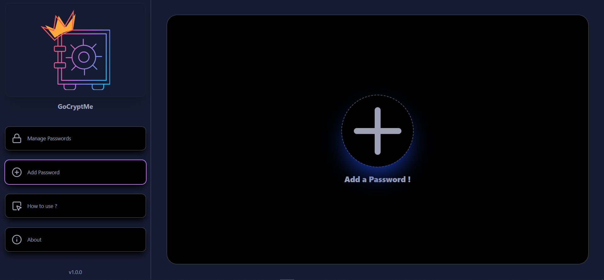

# GoCryptMe app
- A cross-platform desktop application for securely storing and encrypting passwords locally using industry-standard algorithms like PBKDF2 and AES-GCM-256. Supports both Windows and Mac environments

